<p align="center">
  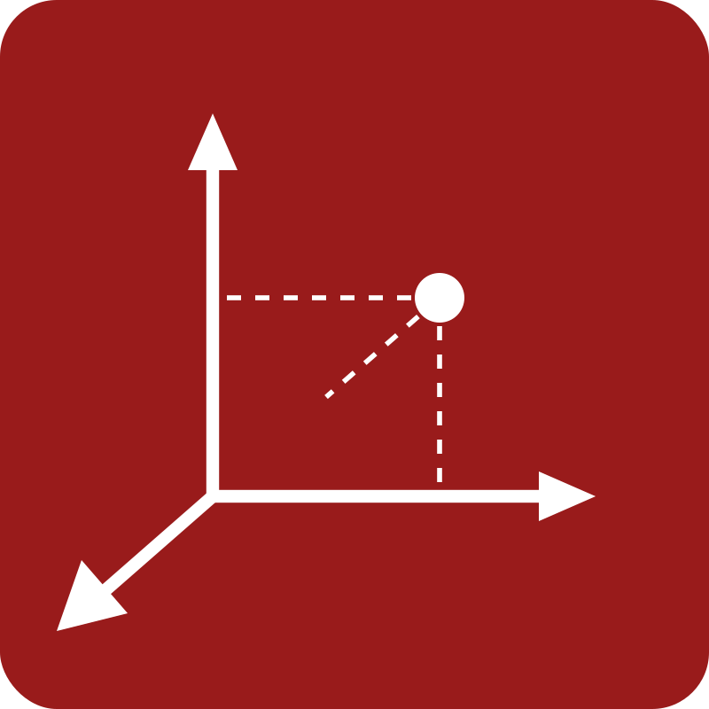
</p>

<h1 align="center">新诉讼可视化 · New Litigation Visualization</h1>
<p align="center"><b>把法律画出来 · Make the Law Visible</b></p>

<p align="center">
  
  <a href="LICENSE"></a>
  
  
  <a href="https://github.com/MiaoQichuan/mqc-litigation-visual-redraw/actions/workflows/checks.yml"></a>
  
  
  
  
  
  
  
</p>

---

# mqc-litigation-visual-redraw · 诉讼可视化重画

> 把一张凌乱或"AI 味"的诉讼图，重画成克制、专业、可直接进诉讼材料的 **SVG + PNG**。
> 不改一个字、不改法律含义，只提升视觉表达。

**定位**：本 skill（`mqc-litigation-visual-redraw`）是 **新诉讼可视化 / New Litigation Visualization**
的首个开源模块，专责"识别用户上传的丑图/乱材料 → 拆解 → **重画**成标准诉讼图"。它是系统里
"重画/可视化"这一块，后续模块（如证据目录、文书生成、案情结构化提取等）将陆续加入同一命名族。
本模块可独立使用。

## 仓库结构

```
mqc-litigation-visual-redraw/
├── SKILL.md                 技能主文档（工作流、布局选择、红线）
├── README.md · AUTHOR.md · CHANGELOG.md · LICENSE
├── assets/
│   ├── style-tokens.json    冻结的视觉数值（颜色/字体/圆角…）
│   ├── fonts/README.md      标题宋体字体政策
│   ├── screenshots/ · modes/     成品截图与三档对照图
├── schemas/
│   └── semantic-map.schema.json   语义地图 JSON 契约（schema_version:1）
├── references/              规程与标准（英文）
│   ├── STANDARDS.md         单一权威（规则+跨领域决策；数值以各细则为准）
│   ├── extraction-guide.md  ★识别·分析·拆解 六步规程（含纯文字/手绘源）
│   ├── semantic-map-schema.md · visual-style.md · fidelity-rules.md
│   ├── flowchart-spec.md · relationship-spec.md · rendering-and-workflow.md
│   └── visual-style.md      奇川流 / 白描 / 歸葬流 三档冻结标准
├── scripts/                 确定性渲染管线（模型只填 JSON、脚本算全部坐标）
│   ├── render.py            调度 + CLI(validate/lint) + 三档模式后处理 + SVG→PNG
│   ├── common.py            token/字体/wrap(禁则+CJK)/校验/marker
│   ├── render_points·dated·spans·flow·relation·tree·compare.py  七个渲染器
│   ├── audit.py             交付摘要 + 提取门禁(CHECKPOINT)
│   ├── doctor.py            环境自检（裸仓库 clone 后第一步）
│   └── lint.py              渲染期视觉 lint（越界/文字溢出/非有限/对角/离色板…）
├── examples/                8 份真实语义地图（覆盖 7 布局；单一真相源，测试直接引用）
└── tests/
    ├── run_checks.py        回归（零依赖，退出码 0=全过）
    └── fixtures/            edge_* 边界压力用例
```

---

## 能做什么

三类图、七种布局，**一套确定性工程 × 三种视觉模式**——布局与走线的规矩不变，
表达按使用场景切换（奇川流 · 歸葬流 · 白描，详见下文「三种视觉模式」）：

| 类型 | 布局 | 适用 |
| --- | --- | --- |
| 时间轴 · 编号型 | `numbered_point_timeline` | 事实经过时间轴（签约→违约→起诉→判决），编号等距圆点卡片；无精确日期或事件密集时的安全默认 |
| 时间轴 · 日期型 | `dated_point_timeline` | 精确日期、间隔有法律意义的长跨度年表，按真实日期成比例的诚实刻度轴 |
| 时间轴 · 期间型 | `proportional_gantt` | 诉讼时效 / 保证期间 / 履行期间，按真实日期成比例的甘特条（条长与重叠即法律主张） |
| 流程图 | `graphviz_flow` | 案件程序 / 请求权路径 / 攻防路径，圆角步骤 · 六边形判断 · 胶囊起止；TB/LR 双向 |
| 关系图 · 网络 | `graphviz_relation` | 当事人关系 / 担保 / 股权 / 资金流，自由布局 + 带标签有向关系线 |
| 关系图 · 层级树 | `relation_tree` | 实际控制人 → 控股 → 子公司等严格层级结构，对称树、等高等宽、深度渐变 |
| 关系图 · 对比表 | `comparison_table` | A vs B 逐维度横向对读（两裁判要旨 / 两诉讼方案），关系类的对比变体 |

## 成品示例

`examples/` 直接渲染出的 **7 种图表类型**（下图为默认的 **奇川流**：宋体标题、灰阶 + 唯一深红 `#991B1B`）：

<table>
  <tr>
    <td width="50%" align="center">
      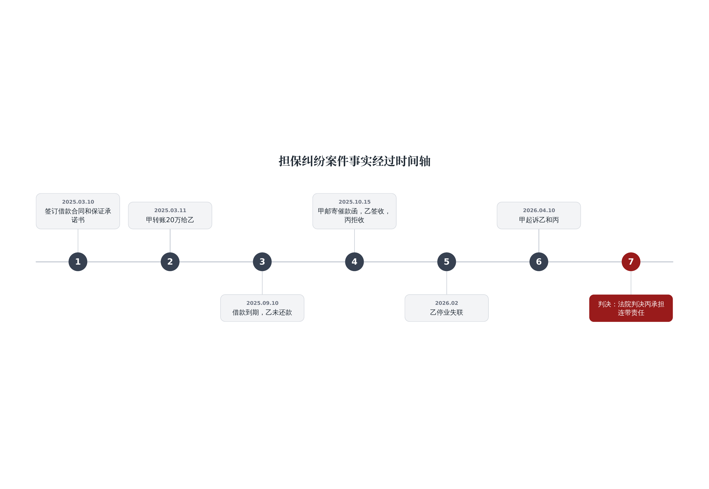<br/>
      <b>时间轴 · 编号型</b> · <code>numbered_point_timeline</code>
    </td>
    <td width="50%" align="center">
      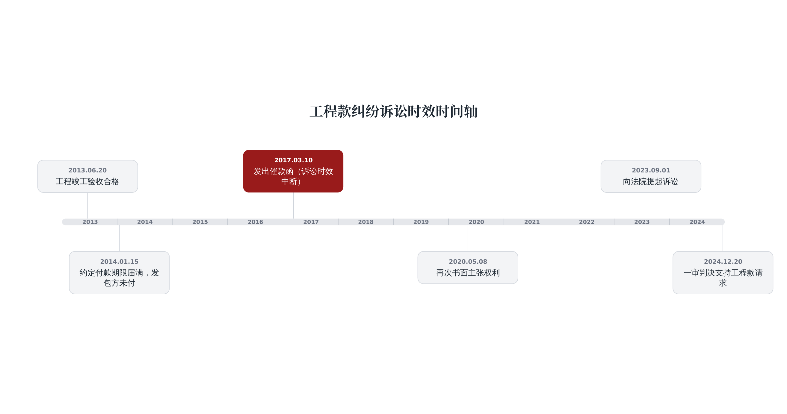<br/>
      <b>时间轴 · 日期型</b> · <code>dated_point_timeline</code>
    </td>
  </tr>
  <tr>
    <td width="50%" align="center">
      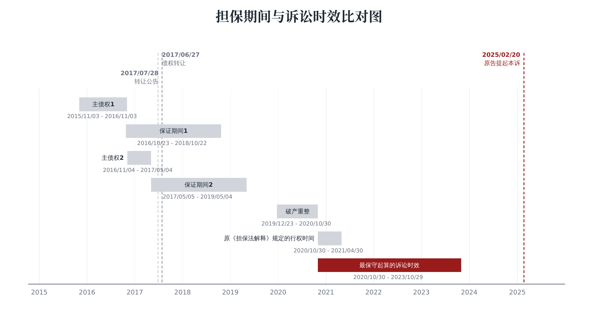<br/>
      <b>时间轴 · 期间型</b> · <code>proportional_gantt</code>
    </td>
    <td width="50%" align="center">
      <br/>
      <b>流程图</b> · <code>graphviz_flow</code>
    </td>
  </tr>
  <tr>
    <td width="50%" align="center">
      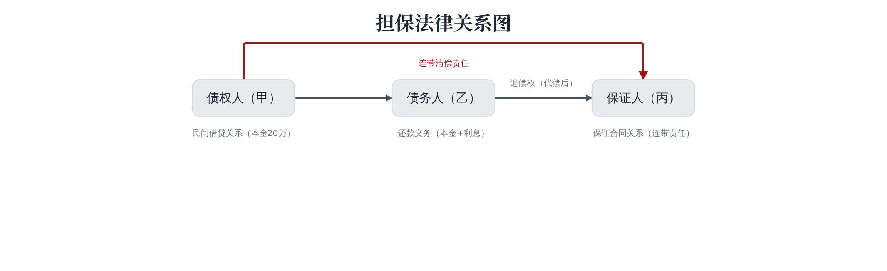<br/>
      <b>关系图 · 网络</b> · <code>graphviz_relation</code>
    </td>
    <td width="50%" align="center">
      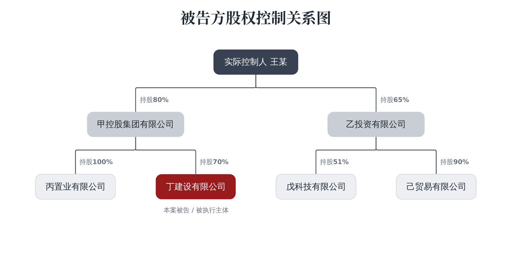<br/>
      <b>关系图 · 层级树</b> · <code>relation_tree</code>
    </td>
  </tr>
  <tr>
    <td width="50%" align="center">
      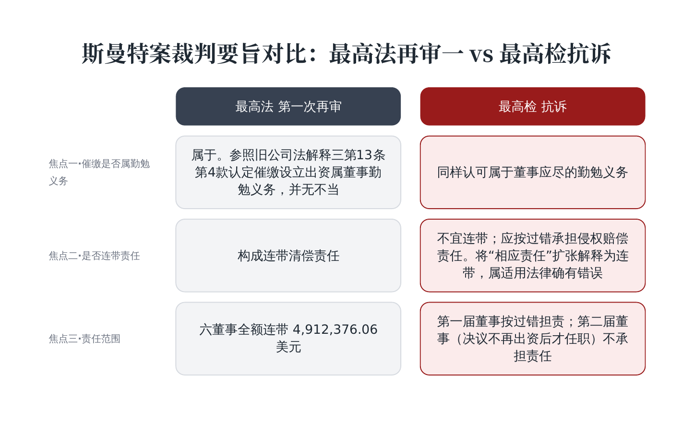<br/>
      <b>关系图 · 对比表</b> · <code>comparison_table</code>
    </td>
    <td width="50%"></td>
  </tr>
</table>

### 同一张图 · 三种模式

**同一套几何**（确定性布局 + 正交走线），换三种表达 —— 顺序均为
**奇川流 · 歸葬流 · 白描**（流程图为横排，其余为竖排，自上而下）：

| 图表类型 | 三档对照 |
|---|---|
| 流程图 | 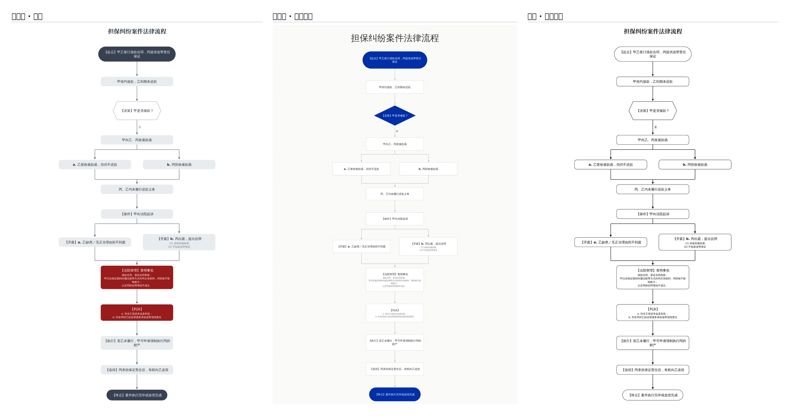 |
| 关系图 · 网络 | 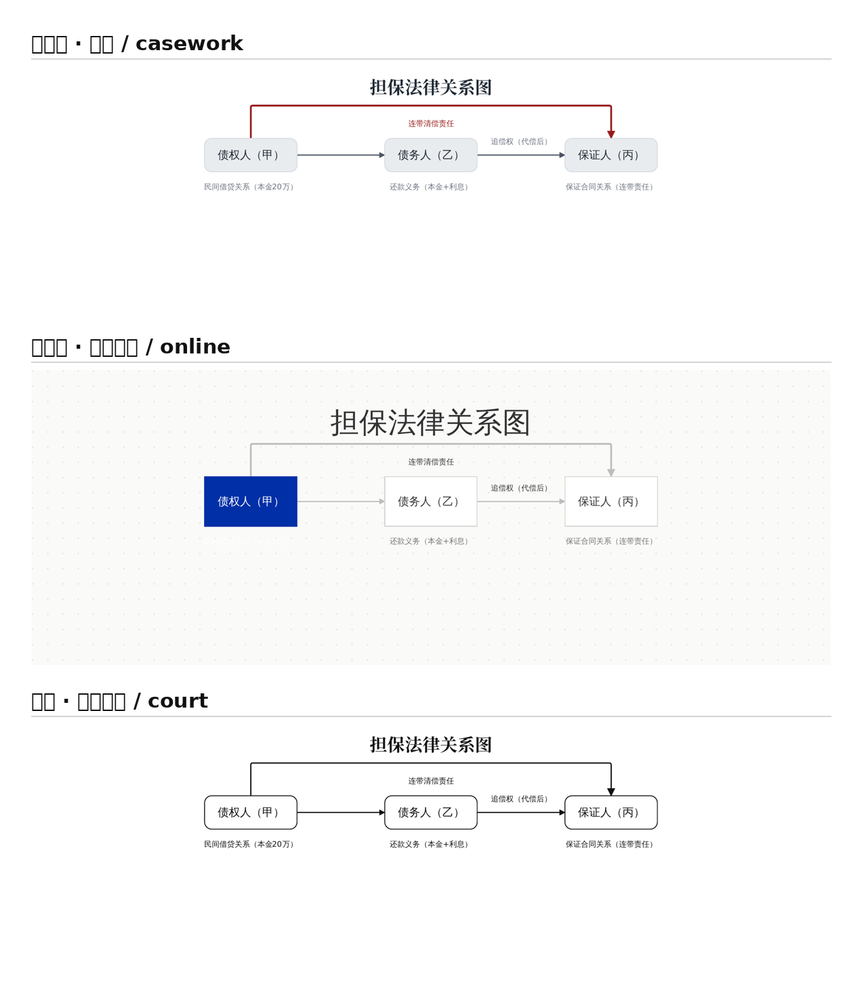 |
| 关系图 · 层级树 | 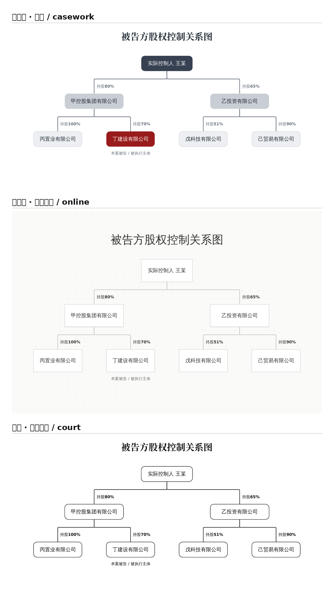 |
| 时间轴 · 编号型 | 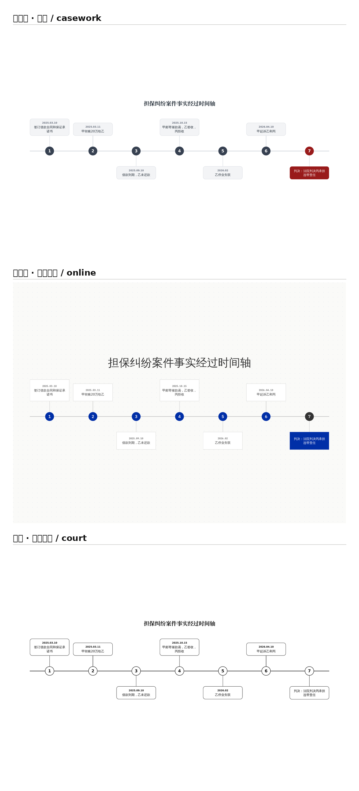 |
| 时间轴 · 日期型 | 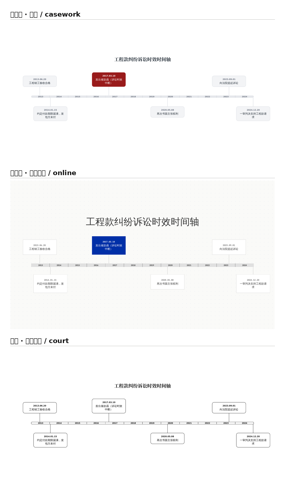 |
| 时间轴 · 期间型 | 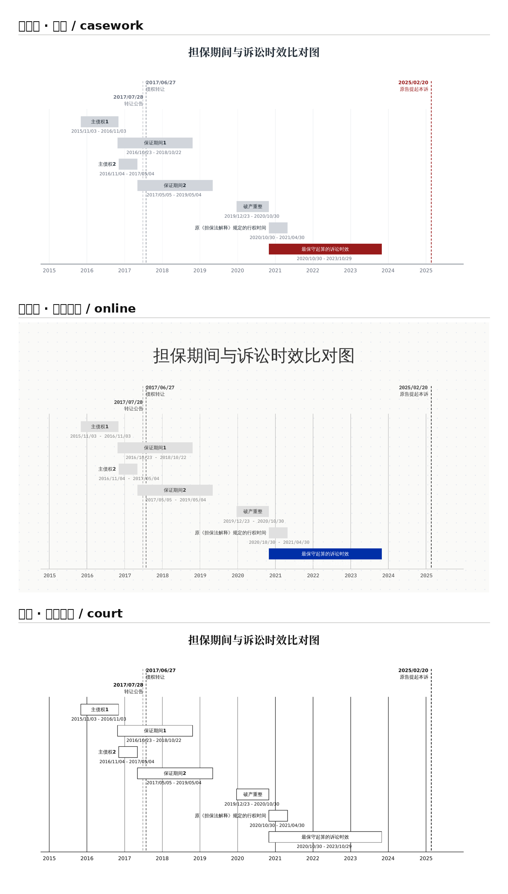 |
| 关系图 · 对比表 | 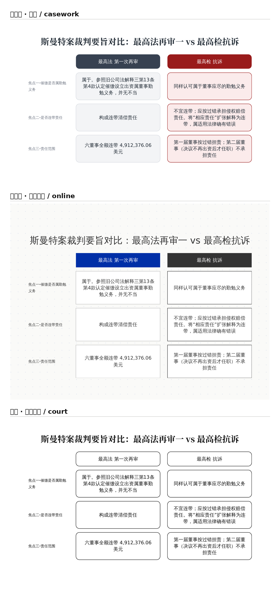 |
| **压力测试** · 密集关系图 | 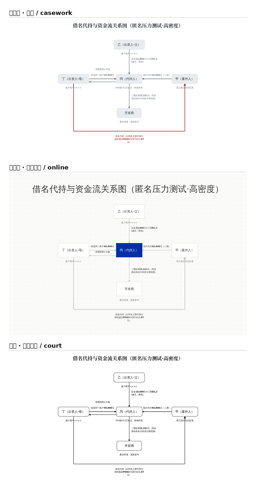 |

## 三种视觉模式

同一套布局与走线**工程**（奇川流的规矩：确定性布局、正交走线、不穿节点、标签不压线），
三种**艺术表达**，对应三种场景。奇川流是彩色母版；另两档只在被请求时通过后处理生效，
母版逐字节不受影响。

| 模式 | 触发 | 视觉 | 场景 |
|---|---|---|---|
| **奇川流** | 默认 | 宋体标题、灰阶 + 一处深红 `#991B1B`、圆角实心卡、决策圆角六边形 | 办案 / 个人品牌专业图 |
| **白描** | `--baimiao`（别名 `--mono`/`--print`/`--court`）或 `"visual_mode":"白描"` | 纯黑白线稿：全部 `#111111`、纯色块变白底框线、几何与彩色版逐字节一致 | 法院 / 打印 / 正式卷宗 |
| **歸葬流** | `--guizang`（别名 `--swiss`/`--ikb`）或 `"visual_mode":"歸葬流"` | 克莱因蓝 `#002FA7` + 浅灰 + 白，无衬线中文 + IBM Plex Mono 数字英文，直角发丝边、纯色蓝块白字、点阵底、大居中轻标题、更方模块 | 线上传播 / 讲课分享 |

歸葬流的蓝色只落在**重点**上：流程图决策菱形与起终点、关系图枢纽、时间轴重点事件、
甘特关键期间——一律蓝底白字；其余为中性灰 / 白。时间轴为浅灰加粗色带（深灰竖线贯穿、
年份居中），连线藏于色带之后。冻结标准见 `references/visual-style.md`。三档并列示例见
`examples/` 与展示图。

## 核心工程原则

**模型只产出 JSON，绝不碰坐标。** 所有布局、防重叠、换行、渲染都交给确定性脚本——
所以在**较弱的模型**上也能出稳定、专业的效果。

## 工作流

1. 读懂原图，逐字提取文字 → 写成 `semantic-map.json`（见 `references/semantic-map-schema.md`）
2. **人工确认 checkpoint**：把提取结果和不确定项给用户确认，再渲染
3. 一条命令渲染：
   ```bash
   python scripts/render.py <semantic-map.json> final
   ```
   产出 `final.svg`（主交付、可编辑）+ `final.png`（预览/提交）+ 自检摘要
4. 交付 SVG + PNG + 一行语义审计

## 快速开始（裸仓库第一步）

`git clone` 只带来代码，不带来它调用的系统工具（graphviz、光栅化器、字体）。
先跑自检，它会告诉你缺什么、怎么装、缺了会退化成什么：

```bash
python3 scripts/doctor.py          # 环境自检（必需项缺失时退出码 1）
python3 scripts/render.py examples/flowchart.json /tmp/out
python3 tests/run_checks.py        # 回归自测
```

## 依赖

- **Python 3** —— 仅标准库，**无需 `pip` 安装任何第三方包**
- **graphviz（`dot`）**：流程图 / 关系图定位需要；时间轴不需要
- CJK 字体（如 Noto Sans CJK SC），否则 PNG 中文显示为空框
- SVG→PNG：自动探测 `rsvg-convert`/`resvg`/`inkscape`/`cairosvg`，都没有则回落 `soffice`(LibreOffice)→PDF→`pdftoppm`

## 标题字体（宋体）与开源合规

图表**标题**使用宋体（公文标题气质），正文/卡片仍为黑体。标题字体按三层降级：

1. **优先·真身**：方正小标宋简体（商业字库，**只按名引用、绝不打包分发**）。想要真正的小标宋效果，
   请在自己机器上安装方正小标宋（很多律师的 WPS/方正字库已含）。
2. **优先·开源回退**：思源宋体（Source Han Serif / Noto Serif CJK，OFL 可合法分发、装机极广、且本渲染
   环境出 PNG 用的就是它）。同一款字在不同系统注册名不同，故三个别名都列入。
3. **兜底**：华文中宋（STZhongsong，Office/WPS 自带，约一半机器都有）→ 通用 `serif`。**全程宋体，绝不落到仿宋。**

标题一律**加粗**（`font-weight:700`；SVG 母版另加 0.3 描边微增笔重）。经 soffice 出 PNG 时会**改用已装宋体的真实粗体字面并去掉描边**（描边会让 LibreOffice 把标题转成错字体轮廓，故仅母版保留）。生成的 **PNG 按本机
已装的最优宋体出图**：装了方正小标宋就用真身，否则用思源宋/华文中宋。SVG 母版携带完整字体栈，
在装有小标宋的机器上打开即显示真身。

## 示例

`examples/` 下有八份可直接渲染的语义地图，覆盖全部七种布局：`timeline-points.json`、
`timeline-dated.json`、`timeline-gantt.json`、`flowchart.json`、`flow-contract-review.json`、
`relationship.json`、`relation-tree.json`、`comparison-table.json`。

## 自测（改动后请运行）

```bash
python tests/run_checks.py     # 回归：渲染 / 该报错就报错 / 几何 / 交付 / 排版 / 树-flow-标准；退出码 0 = 全过
```

回归套件把已修复的问题固化成守卫：节点不重叠、箭头必指向 head、分叉等高、判断分支标签不相撞、
甘特条不越界、关系标签不遮挡、特殊字符转义、深红纪律（每图 ≤2 处）、审计摘要真的会运行（不静默失效）、
中文换行遵守禁则（行首不出现收尾标点，且逐字不改）。

---

> **把法律画出来 · Make the Law Visible** ｜ 新诉讼可视化 New Litigation Visualization ｜ 缪奇川 出品 ｜ v1.0.0
